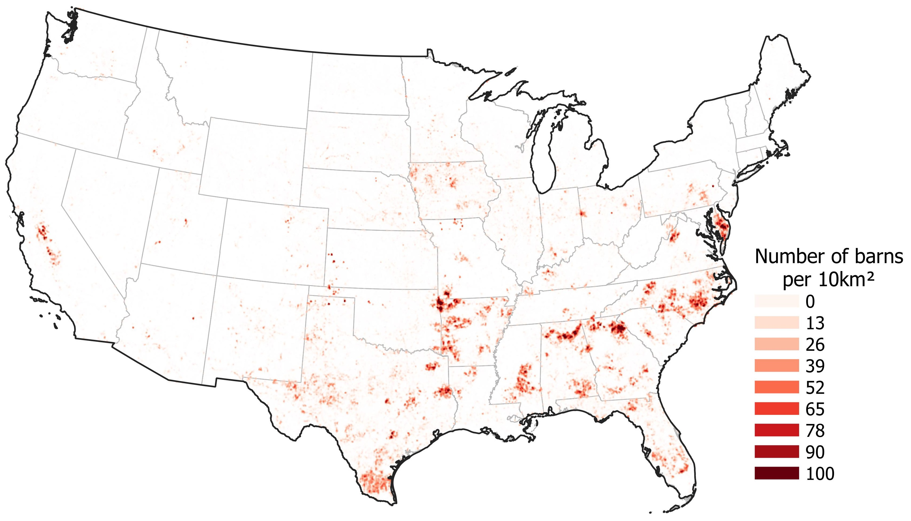
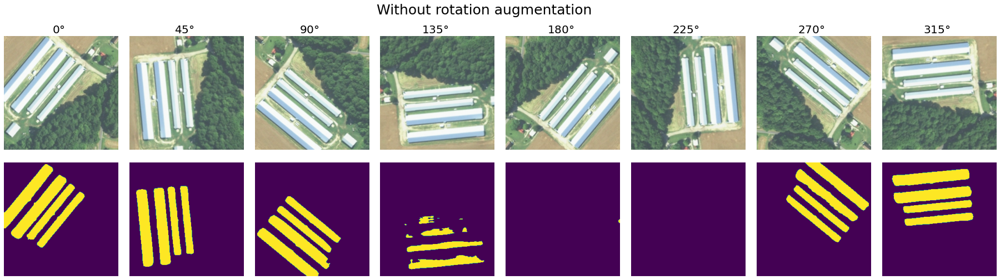
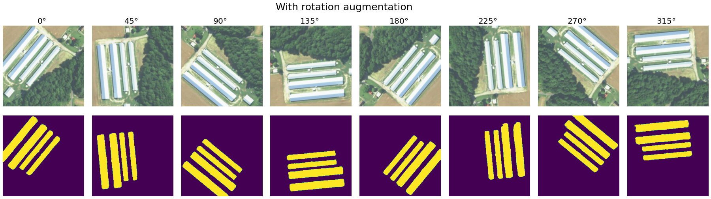
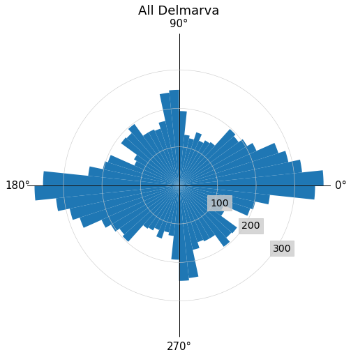
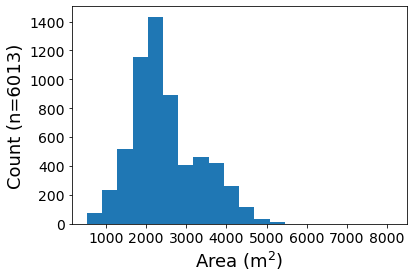
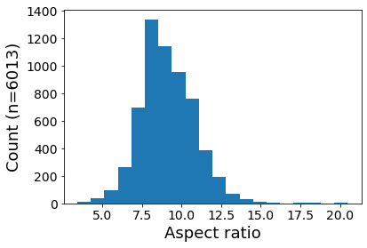

# Poultry barn mapping

**Jump to: [Setup](#setup) | [Dataset and pretrained models](#dataset-and-pretrained-models) | [Model training and evaluation](#model-training-and-evaluation) | [Dataset creation and filtering](#dataset-creation-and-filtering)**

This repo contains code for training, evaluating, and running deep learning models for detecting poultry barns from high-resolution aerial imagery as well as a US-wide datasets of predicted poultry barn locations.
Specifically, we train and evaluate semantic segmentation models with labels from the [Soroka and Duren dataset of poultry barns](https://www.sciencebase.gov/catalog/item/5e0a3fcde4b0b207aa0d794e) over the [Delmarva Peninsula](https://en.wikipedia.org/wiki/Delmarva_Peninsula) and aerial imagery from the [National Agriculture Imagery Program (NAIP)](https://www.fsa.usda.gov/programs-and-services/aerial-photography/imagery-programs/naip-imagery/index), then run our best models over large amounts of NAIP imagery to create datasets of poultry barn locations.
We also develop a post-processing step to filter out false positive predictions at the facility level.
Finally, we release our best trained model, two generated datasets of predicted poultry barns -- one across the entire United States with the latest 1m imagery per state, and another in the Chesapeake Bay with 2017/2018 imagery -- and a validation of our results.

If you make use of this implementation or data in your own project, or you want to refer to it in a scientific publication, **please consider referencing this GitHub repository and citing our paper: link coming soon**:
```
bibtex coming soon
```

<p align="center">
    <br/>
    <b>Figure 1.</b> A heatmap of predicted poultry barn locations across the United States. Download these predictions <a href="https://researchlabwuopendata.blob.core.windows.net/poultry-cafo/full-usa-3-13-2021_filtered_deduplicated.gpkg">here</a>.
</p>

## Setup

First, run the following commands to create a conda environment, "poultry", with the necessary dependencies for running the scripts and notebooks in this repository:
```bash
conda env create -f environment.yml
conda activate poultry
```

Next, follow the instructions in the following sub-sections to set up the different datasets.

Finally, run the following notebooks to prepare various derivative files used by the training and inference pipelines:
- `notebooks/Data preparation - Generate Chesapeake Bay county GeoJSON.ipynb` - This generates a GeoJSON file countaining a polygon for each county intersecting the Chesapeake Bay Watershed.
- `notebooks/Data preparation - Parse NAIP file list.ipynb` - This generates a list of the most recent 1m NAIP imagery tiles per state and a list of the most recent NAIP imagery tiles per state (note: the most recent 1m imagery is usually older as most recent imagery is 0.6m).
- `notebooks/Data preparation - Prepare training and testing splits.ipynb` - This generates masks for all training and testing splits.

### Data sources

#### NAIP tiles

Use the following commands to download a list of all NAIP tiles available through the [Microsoft Planetary Computer](https://planetarycomputer.microsoft.com/):
```bash
wget https://naipblobs.blob.core.windows.net/naip-index/naip_v002_index.zip
unzip naip_v002_index.zip
rm naip_v002_index.zip
mv naip_blob_list.txt data/
```

#### Delmarava poultry barn labels

Download the `Delmarva_PL_House_Final.zip` file from the Soroka and Duren 2020 *Poultry barn* dataset from [here](https://www.sciencebase.gov/catalog/item/5e0a3fcde4b0b207aa0d794e). From the unzipped directory run:
```
conda activate poultry
ogr2ogr -of GeoJSON -t_srs epsg:4326 Delmarva_PL_House_Final2_epsg4326.geojson Delmarva_PL_House_Final2.shp
ogr2ogr -of GeoJSON -t_srs epsg:32618 Delmarva_PL_House_Final2_epsg32618.geojson Delmarva_PL_House_Final2.shp
ogr2ogr -of GeoJSON -t_srs epsg:26918 Delmarva_PL_House_Final2_epsg26918.geojson Delmarva_PL_House_Final2.shp
```

Copy the three generated files, `Delmarva_PL_House_Final2_epsg4326.geojson`, `Delmarva_PL_House_Final2_epsg32618.geojson`, and `Delmarva_PL_House_Final2_epsg26918.geojson` to the `data/` directory in this repository.


## Dataset and pretrained models

The following are download links for our model and final generated datasets:

- [Model weights (465 MB)](https://researchlabwuopendata.blob.core.windows.net/poultry-cafo/train-all_unet_0.5_0.01_rotation_best-checkpoint.pt)
- Full USA predictions with latest 1m NAIP imagery per state:
  - [All predictions (2.5 GB)](https://researchlabwuopendata.blob.core.windows.net/poultry-cafo/full-usa-3-13-2021.gpkg) - 7,108,719 polygons
  - [Filtered predictions (150 MB)](https://researchlabwuopendata.blob.core.windows.net/poultry-cafo/full-usa-3-13-2021_filtered.gpkg) - 424,874 polygons
  - [Filtered (deduplicated) predictions (128 MB)](https://researchlabwuopendata.blob.core.windows.net/poultry-cafo/full-usa-3-13-2021_filtered_deduplicated.gpkg) - 360,857 polygons
- Chesapeake Bay predictions with 2017/2018 NAIP imagery:
  - [All predictions (176 MB)](https://researchlabwuopendata.blob.core.windows.net/poultry-cafo/chesapeake-bay-3-18-2021.gpkg) - 496,181 polygons
  - [Filtered predictions (10 MB)](https://researchlabwuopendata.blob.core.windows.net/poultry-cafo/chesapeake-bay-3-18-2021_filtered.gpkg) - 26,284 polygons

Each polygon in the above datasets contains 8 features:
- `p` - The averaged model predicted probability over all imagery pixels within the polygon.
- `rectangle_area` - The area of the entire polygon in square meters.
- `area` - The area of just the positively predicted pixels under the polygon in square meters.
- `rectangle_aspect_ratio` - The ratio of the polgon's long side to its short side.
- `distance_to_nearest_road` - The distance from the polygon to the approximate nearest road from OpenStreetMap.
- `year` - The year that the source NAIP imagery was captured.
- `date` - The date that the source NAIP imagery was captured.
- `image_url` - The URL to the source imagery that was used to create the prediction.

The "filtered and filtered (deduplicated) predictions" are created following the method described in [Dataset creation and filtering](#dataset-creation-and-filtering).

## Model training and evaluation

Our experiments can be reproduced with `python scripts/run_experiments.py`. This script will run `train.py` in parallel with a hyperparameter sweep. If you set `TEST_MODE=True` then the individual commands will be printed to STDOUT, allowing you to selectively run a subset of the experiments.

The `scripts/run_test_inference_and_evaluation.py` script will use the model checkpoints (the best checkpoints according to validation metrics) from each experiment, run them on all of the imagery from the test set, and report tile level metrics in CSV files. Our results from this step can be found in `results/`.

A notable result we find with our experiments is the importance of rotation augmentation:

<p align="center">
<br/>
<br/>
<b>Figure 2.</b> Predictions from models trained with and without rotation augmentation. These models exhibit similar validation and test perfomance as the distribution of building rotations is similar between training/validation/test, however rotation augmentation results in a model with stronger generalization performance.
</p>

Rotation augmentation is particularly important for our models as the poultry CAFOs in our labeled data are strongly biased to have north-south oriented barns:
<p align="center">
<br/>
<b>Figure 3.</b> Histogram of orientations of barns from the Soroka and Duren dataset.
</p>


## Dataset creation and filtering

### Creation

To create the Chesapeake Bay dataset for example, first, download the [model weights](https://researchlabwuopendata.blob.core.windows.net/poultry-cafo/train-all_unet_0.5_0.01_rotation_best-checkpoint.pt) to `output/train-all_unet_0.5_0.01_rotation_best-checkpoint.pt`.
Then, run the model over all NAIP imagery in the Chesapeake bay - `python scripts/run_chesapeake-bay-3-18-2021_inference.py`.
Finally, run the post-processing pipeline over the model's per-pixel predictions - `bash scripts/run_chesapeake-bay-3-18-2021_postprocessing.sh` - resulting in a set of polygons with features that can be used to filter false positives as described below.

To create the dataset over the entire US we follow the same process, see `scripts/`.

### Filtering

For filtering out false positive predictions we use the distribution of _areas_ and _aspect ratios_ seen in the Soroka and Duren dataset (under the assumptions that all poultry barns will follow these distributions). The mean _area_ is 2477.18 m^2 with a standard deviation of 849.69 m^2 and a range of [525.69, 8106.53] m^2. The mean aspect ratio is 9.10 with a standard deviation of 1.72 and range of [3.4, 20.49].

Any prediction with a feature `rectangle_area` that falls outside of the [525.69, 8106.53] range, with a feature `rectangle_aspect_ratio` that falls outside of the [3.4, 20.49] range, or that has a `distance_to_nearest_road` of 0 is counted as a false positive and removed.

Any prediction with a feature `rectangle_area` that falls outside of the [525.69, 8106.53] range, with a feature `rectangle_aspect_ratio` that falls outside of the [3.4, 20.49] range, or that has a `distance_to_nearest_road` of 0 is counted as a false positive and removed.

<p align="center">
<br/>
<b>Figure 4.</b> Distribution of the areas and aspect ratios of barns from the Soroka and Duren dataset.
</p>

### Deduplication

The NAIP tiles that we perform inference over have overlap between adjacent tiles. As such, some barns are duplicated in the raw set of predictions if they fall in these overlapping areas.
To fix this, our final post-processing step is to merge overlapping predictions (i.e. to deduplicate predictions in the dataset). To do this, we iteratively merge overlapping polygons keeping the attributes of the largest. For the filtered "Full USA" set of predictions, this reduces the final number of predictions from 424,874 to 360,857 polygons.


## External data licensing

- Poultry barn dataset - Credit: Soroka, A.M., and Duren, Z., 2020, Poultry feeding operations on the Delaware, Maryland, and Virginia Peninsula from 2016 to 2017: U.S. Geological Survey data release, https://doi.org/10.5066/P9MO25Z7.
- NAIP imagery - Credit: U.S. Department of Agriculture, Farm Service Agency, https://www.fsa.usda.gov/programs-and-services/aerial-photography/imagery-programs/naip-imagery/index.
- AgCensus - Credit: U.S. Department of Agriculture, National Agricultural Statistics Service, https://www.nass.usda.gov/AgCensus/.
- OpenStreetMap road network - Credit: OpenStreetMap contributors. OpenStreetmap is available under the Open Database License, which can be found here: https://www.openstreetmap.org/copyright.

## License

This project is licensed under the [MIT License](LICENSE).

The datasets are licensed under the [Open Use of Data Agreement v1.0](https://cdla.dev/open-use-of-data-agreement-v1-0/).

## Contributing

This project welcomes contributions and suggestions.  Most contributions require you to agree to a
Contributor License Agreement (CLA) declaring that you have the right to, and actually do, grant us
the rights to use your contribution. For details, visit https://cla.opensource.microsoft.com.

When you submit a pull request, a CLA bot will automatically determine whether you need to provide
a CLA and decorate the PR appropriately (e.g., status check, comment). Simply follow the instructions
provided by the bot. You will only need to do this once across all repos using our CLA.

This project has adopted the [Microsoft Open Source Code of Conduct](https://opensource.microsoft.com/codeofconduct/).
For more information see the [Code of Conduct FAQ](https://opensource.microsoft.com/codeofconduct/faq/) or
contact [opencode@microsoft.com](mailto:opencode@microsoft.com) with any additional questions or comments.

## Trademarks

This project may contain trademarks or logos for projects, products, or services. Authorized use of Microsoft 
trademarks or logos is subject to and must follow 
[Microsoft's Trademark & Brand Guidelines](https://www.microsoft.com/en-us/legal/intellectualproperty/trademarks/usage/general).
Use of Microsoft trademarks or logos in modified versions of this project must not cause confusion or imply Microsoft sponsorship.
Any use of third-party trademarks or logos are subject to those third-party's policies.
